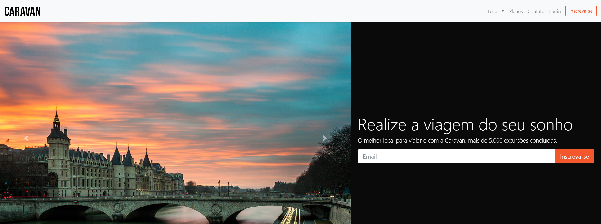

# CARAVAN
> Projeto caravan criado no curso de Bootstrap na Origamid, o foco era criar um site com apenas elementos do Bootstrap, responsivo para todas as plataformas.


## Link do curso

Origamid (<https://www.origamid.com/>)




## Como usar e ver o projeto

OS X & Linux:

```sh
Não é preciso instalar nada, apenas baixar o repositório e abrir o arquivo HTML em seu navegador.
```

Windows:

```sh
Não é preciso instalar nada, apenas baixar o repositório e abrir o arquivo HTML em seu navegador.
```

## Gostou ?

1. Conecte-se ao meu Linkdin (<https://www.linkedin.com/in/alex-teixeira-da-fonseca-5a99931a2/>)
2. Me siga aqui no GitHub 